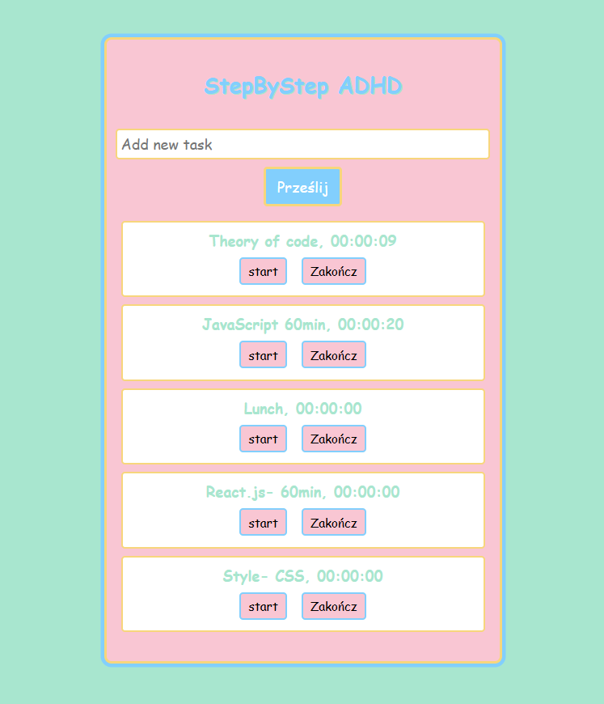

>

## About the project

Created as a personal tool for tracking tasks with a timer — inspired by ADHD productivity techniques. Tasks can be started, stopped, completed, and removed, with every operation synced to a local JSON server (simulating REST API).

## 🚀 Run Locally

- git clone https://github.com/MstowskaSandra/task-react-components.git
- cd task-react-components
- npm install
- npm start

**To run the mock API:**  
You need to launch JSON Server in a separate terminal window before starting the app.

Install JSON Server and run:
- npx json-server --watch db/data.json --port 3005

## 🧩 Features

- Add new tasks via simple form
- Start/stop individual task timers (each displayed in hh:mm:ss format)
- Mark tasks as completed or remove them
- All task actions updated via REST API provider (TaskAPI.js)
- Vibrant pixel-art design and color scheme for positive motivation

## 🛠️ Tech Stack

- React  
- JavaScript (ES6+)  
- CSS (custom styles, pixel art & pastel palette)  
- npm  
- Git  
- JSON Server (for mock API)

## ✨ What I learned

- Integrating REST API in React (GET, POST, PATCH)
- Handling intervals and timers in component state
- User experience design for ADHD/task productivity
- Building pixel-art inspired UIs with custom CSS
- Clean architecture with separation API/service logic

## About Me

Junior frontend developer with a passion for playful user interfaces and productivity tools. I enjoy creating vibrant, accessible apps and learning best practices for API integration.

## Why you should consider me

I’m a self-driven learner, passionate about front-end development. Even though I’m new to commercial work, this project shows I’ve got the skills and mindset to create great websites. I’m ready to grow and take on challenges as a junior front-end developer.

## 📄 License

Created for educational purposes by Sandra Mstowska.